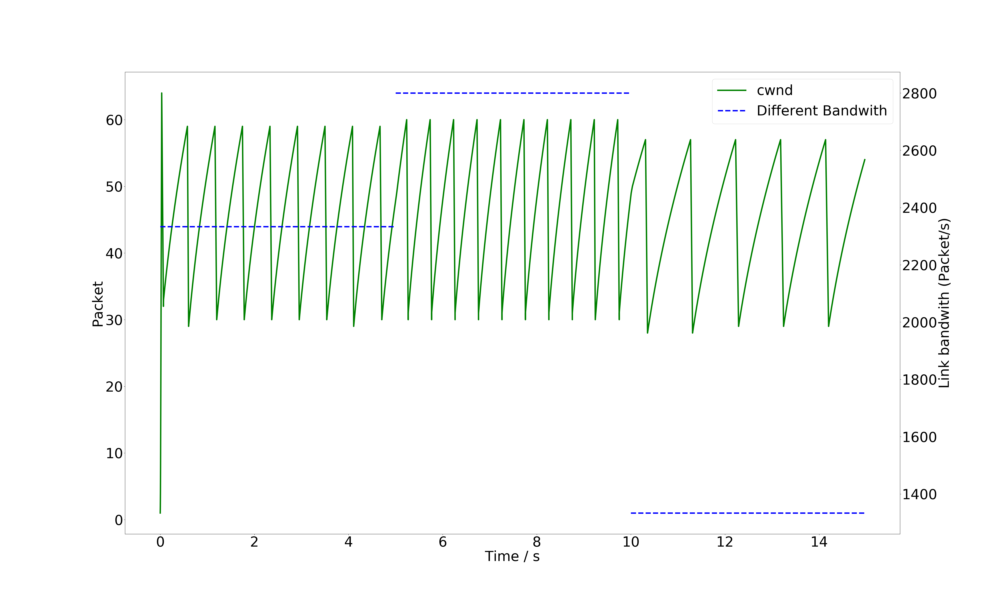
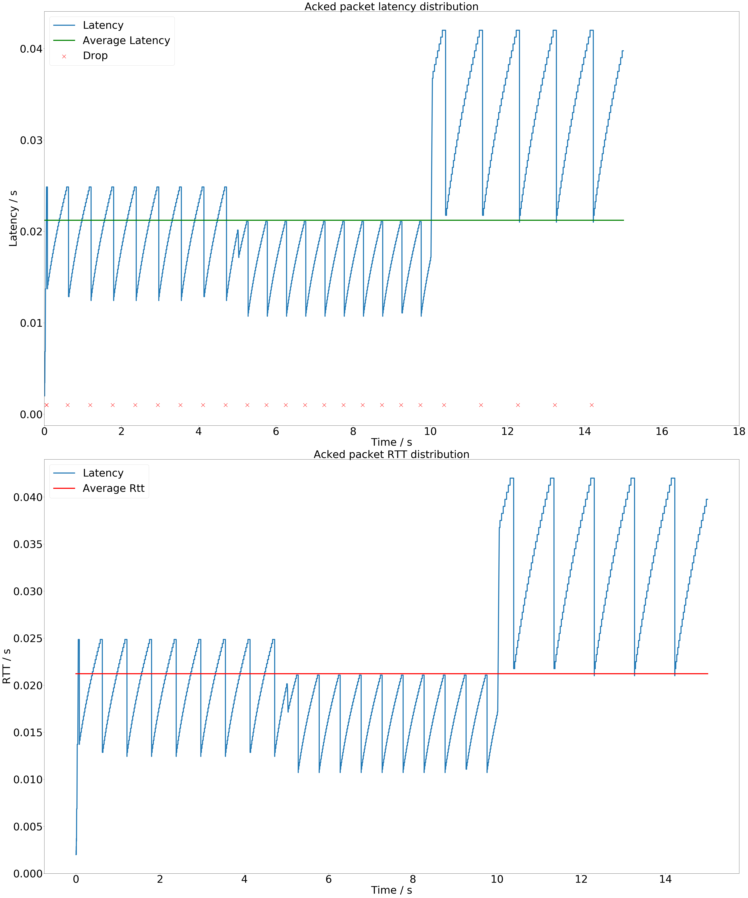

# Quickly Start

## For pypi

We have package our repository into [DTP_Emulator](https://pypi.org/project/DTP-Emulator/),
which means that you can run order

> pip install DTP-Emulator

to install it.

There may be some differences between this and below. But you can finished according to the next steps :

- create your module

```python
from simple_emulator import Packet_selection, CongestionControl


# Your solution should include packet selection and congestion control.
# So, we recommend you to achieve it by inherit the objects we provided and overwritten necessary method.
class Solution(Packet_selection, CongestionControl):
    pass
```

- create emulator

```python
from simple_emulator import PccEmulator


# Use the object you created above
my_solution = Solution()
emulator = PccEmulator(solution=my_solution)
```

- run emualtor

```python
# You can specify the time for the emualtor's running.
# It will run until there is no packet can sent by default. 
emulator.run_for_dur()
```

Here is an complete  [demo](https://github.com/Azson/DTP-emulator/blob/pcc-emulator/demo_1.py) about the using of pypi.

## For this repository

For players, you need to finish the code both of  "congestion_control_algorithm.py" 
and "block_selection.py" files in path of "/player".

Here we provide you some congestion control algorithm.
By default the congestion control is "reno" and block selection algorithm is selecting block which is closest to it's deadline.

Then, just run the order "python3 main.py".

You will get some output in the path "/output/" and should fix your code according to the output.

Here is an complete  [demo](https://github.com/Azson/DTP-emulator/blob/pcc-emulator/deom_2.py) about the using of pypi.

# For Detail

## player

Here are the 2 modules that players need to finished.

### aitrans_solution.py

It should be implemented with these method :

- [select_packet](#select_packet)
- [make_decision](#make_decision)
- [append_input](#append_input)

In case you forget, we recommend you implement by inheriting the objects from Solution in packet_selection.py
and Solution in congestion_control_algorithm.py and overwrite there methods.

### packet_selection.py

In this module, you have to implement the function "select_packet" with the parameters "cur_time, packet_queue" and return an integer value which means the packet index in packet queue, which will be sent at the time "cur_time".

Here we provided a [example](https://github.com/Azson/DTP-emulator/blob/pcc-emulator/player/packet_selection.py) of selecting packet by the **create time** firstly, and **radio of rest life time to deadline** secondly.

#### select_packet

For every packet in packet queue, it's implement in "objects/packet.py". But we recommend you to get more information at  [Packet](#packet-log) .

### congestion_control_algorithm.py

In this module, you have to implement a class with member function "make_decision" and "append_input". So we recommend you to accomplish this by inheriting from the object of "CongestionControl" implemented in "cc_base.py" in case you forget these. 

Here we provided some simple algorithms about congestion control to help you being familiar with this competition.
Like [Reno](https://github.com/Azson/DTP-emulator/blob/pcc-emulator/player/examples/reno.py), [BBR](https://github.com/Azson/DTP-emulator/blob/pcc-emulator/player/examples/simple_bbr.py) and an example about [reinforcement learning](https://github.com/Azson/DTP-emulator/blob/pcc-emulator/player/examples/RL.py) implemented by tensorflow.

#### make_decision

For the member function "make_decision", we will call it every time I want to send a packet. And it should return a dictionary with window size and send rate according to the information from "_input_list", just like below.

```json
{
    "cwnd" : 10,
    "send_rate" : 10
}
```

#### append_input

For item information in "_input_list",  it is a triad of **(event_time, packet_type, and packet)**. 

- event_time

  > The time when the packet arrived.

- packet_type

  > We divide the packet into three categories : PACKET_TYPE_FINISHED, PACKET_TYPE_TEMP, PACKET_TYPE_DROP.
  >
  > PACKET_TYPE_FINISHED : The acknowledge packet that successfully reached the source point;
  >
  > PACKET_TYPE_TEMP : The packet that have not yet reached the source point;
  >
  > PACKET_TYPE_DROP : The packet used to inform the source point of packet loss.

- packet

  > The packet it the object implemented in "objects/packet.py". But we recommend you to get more information at [Packet](#packet-log) .

Why we design a individual function to add element to "_input_list"?

It's because there are some congestion control algorithm that need to update window size and send rate immediately. So you need to return a dictionary with window size and send rate if you want to do some changes as soon as the data is received , like [here](#make_decision).

## config

### constant

Here are some constants that may be help for you：

- USE_CWND

  > Set "False" if your congestion control algorithm don't use cwnd.

- ENABLE_LOG

  > Set "False" if you don't want to generate packet log in path "output/packet_log".

- MAX_PACKET_LOG_ROWS

  > The number of rows for a single packet log. If you just want to use one file to log, set it "None".

All of these constants can be set on the create of emulator by the key words arguments.

### Block data

We create the block by using the file "data_audio.csv" and "data_video.csv" which are record from WebRTC.

For "data_audio.csv", the first columns is the created time of block and the second columns is the block size. 

| 时间 (s) | 数据大小 (B) |
| -------- | ------------ |
| 0.0      | 514          |
| 0.06     | 305          |
| ...      | ...          |

For "data_video.csv", it has the same columns like "data_audio.csv" except the third columns, which means P frame or I frame.

| 时间 (s) | 数据大小 (B) | 关键帧 |
| -------- | ------------ | ------ |
| 0.0      | 9584         | P      |
| 0.033    | 8069         | P      |
| ...      | ...          | ...    |

### Trace data

We use the generated trace data by using the Hidden Markov algorithm to simulate the bandwidth changing of the network, which is implemented in "scripts/network.py". 

For the trace file, the first columns is the changed time of bandwidth. The second columns is the bandwidth whose unit is megabytes. And the third columns is the link random loss rate. Finally, the last columns is the fixed propagation delay of link whose unit is seconds.

| 时间 (s) | 带宽 (MB)          | 丢包率 | 传播时延 (s) |
| -------- | ------------------ | ------ | ------------ |
| 0        | 19.38592070201254  | 0      | 0.001        |
| 1        | 24.832955411664393 | 0      | 0.001        |
| ...      | ...                | ...    | ...          |

## objects

Here are all the objects that our system uses. You can get more details from our powerpoint presentation.

What I want to emphasize here is that, your congestion control module, which implemented in "player/congestion_control_algorithm.py", should inherit from the object of "CongestionControl" implemented in "cc_base.py". 

We've provided some examples of classic congestion control algorithms in path "player/examples", like [Reno](https://en.wikipedia.org/wiki/TCP_congestion_control), [BBR](https://en.wikipedia.org/wiki/BBR) .

## output

### packet log

We will output all the packet log into the directory. Here you can get one packet all life time.

Because of there may be so many packet information that logging file is big. So we split all information into different files if its rows exceed **MAX_PACKET_LOG_ROWS** which you can reset in "config/constant.py".

For every row,  it's form like below：

```json
{
    "Time": 0.0, 
    "Waiting_for_ack_nums": 0, 
    "Type": "S", 
    "Position": 0, 
    "Send_delay": 0.0, 
    "Pacing_delay": 0.0, 
    "Lantency": 0.0, 
    "Drop": 0, 
    "Packet_id": 1, 
    "Create_time": 0.0, 
    "Offset": 0, 
    "Payload": 1480, 
    "Packet_size": 1500, 
    "Extra": {
        "Cwnd": 1
    }, 
    "Block_info": {
        "Block_id": 1, 
        "Priority": "0", 
        "Deadline": 0.2, 
        "Create_time": 0.0, 
        "Size": 200000.0
    }
}
```

Here is every key's explanation：

- Time : The time handle this event;
- Waiting_for_ack_nums : The numbers of packets that sended but not acknowledged by source.
- Type : To distinguish sending or acknowledge packet;
- Position : The position that packet on. It's 0 if packet on source. 
- Send_delay : The time that packet sent into window;
- Pacing_delay : The time that packet send into network. It's used in the congestion control like BBR.
- Lantency : The time that packet spending on links including queue delay and propagation delay;
- Drop : Label whether the packet is dropped;
- Packet_id : The Identity of packet;
- Create_time : The time when the packet is created;
- Offset : The offset of the packet in its block;
- Payload : The size of valid data in packet whose unit is bytes;
- Packet_size : The size of the packet whose unit is bytes;
- Extra : The filed we provided for your congestion control. 
We will fill it when system need to send packet (equals to calling "make_decision" method in your solution).
    - Cwnd : The size of crowded window at sender.Its unit is packet; 
- Block_info : The block information that the packet belong to. You can get more from below.

### block log

Here is all of the blocks that the system sent.

For every row, it's form like below：

``` json
{
    "Block_id": 4, 
    "Priority": "0", 
    "Deadline": 0.2, 
    "Create_time": 3.0, 
    "Size": 200000.0, 
    "Send_delay": 0.0, 
    "Latency": 1.4900000000000104, 
    "Finish_timestamp": 3.0425, 
    "Miss_ddl": 0, 
    "Split_nums": 136, 
    "Finished_bytes": 200000.0
}
```

Here is every key's explanation：

- Priority : The degree of emergency of block;
- Block_id : The identity of block;
- Size : The size of block whose unit is bytes;
- Deadline : The block's failure time size;
- Create_time : The time when block is created;
- Send_delay : The sum of all packets's "send_delay" which belong to the block;
- Latency : The sum of all packets's "latency" which belong to the block;
- Finish_timestamp :  The time when block is finished if it don't miss deadine; Otherwise, it's the time when the block was detected failure;
- Miss_ddl : Whether the block is miss deadline;
- Split_nums : The count of packets that the block is divided;
- Finished_bytes : The number of bytes received by the receiver.

### cwnd_changing.png

Here we provided a simple schematic diagram of window change process according to partial packet log.

The horizontal axis is the time(seconds), the left vertical axis is the number of packets, and the right vertical axis is the bandwidth (unit is packet).So solid lines represent window changes and dashed lines represent bandwidth changes.

We put the draw function in the "plot_cwnd" of "utils.py". You can specify the value of "raws" to set the amount of data to be processed, specify the value of "time_range" to set the the time interval you want see, and  specify the value of "scatter" to use a line chart or scatter chart.



### pcc_emulator-analysis.png

Here we provided a simple schematic diagram of latency of packets change process according to partial packet log.

The horizontal axis is the time(seconds), the left vertical axis is the latency of packets. So solid lines represent latency changes. And the cross indicates that the packet was lost at this time.

We put the draw function in the "analyze_pcc_emulator" of "utils.py". You also can describe these parameters mentioned above and do some customization, like "rows", "time_range" and "scatter".



### throughput_changing.png


# Todo list

- [x] Add BBR congestion control module.
- [x] Add AI congestion control module.
- [ ] Add QOE mudule.
- [ ] Add system presentation PPT.